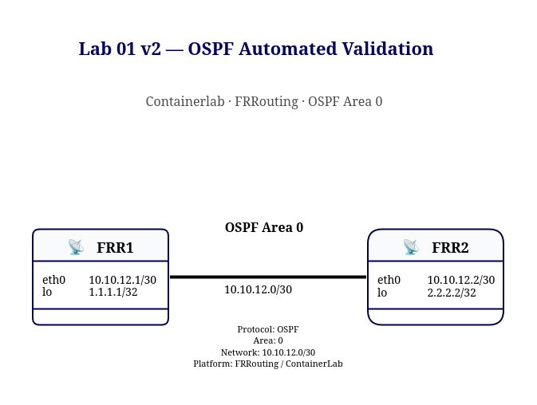

# Lab 01 v2 — OSPF Automated Validation

This lab extends the original manual OSPF topology with an automated validation workflow using Python.

## Objective

The goal is to validate OSPF health automatically instead of relying only on manual CLI checks.

The script verifies:

- OSPF neighbor adjacency
- OSPF-learned loopback routes
- End-to-end loopback reachability
- Overall lab health
- Persistent health reporting

## Topology



## Automation Workflow

```text
Python
  ↓
subprocess
  ↓
docker exec
  ↓
FRRouting / vtysh
  ↓
Collect network state
  ↓
Compare against expected state
  ↓
PASS / FAIL
  ↓
Generate health report
```

## Checks Performed

### Control Plane

The script validates that each router sees the expected OSPF neighbor in Full state.

Expected state:

```text
R1 → Neighbor 2.2.2.2 → Full
R2 → Neighbor 1.1.1.1 → Full
```

### Routing State

The script verifies that the remote loopback is learned through OSPF.

Expected routes:

```text
R1 → 2.2.2.2/32
R2 → 1.1.1.1/32
```

### Data Plane

Loopback-to-loopback reachability is validated using source-specific ICMP tests.

```text
R1: 1.1.1.1 → 2.2.2.2
R2: 2.2.2.2 → 1.1.1.1
```

Using an explicit source address is important because Containerlab nodes also have a management default route.

A normal ping without a source address could accidentally use the management network and produce a false positive.

## Healthy Output

Example:

```text
=== OSPF Health Check ===
clab-frr-ospf-r1: Neighbor 2.2.2.2 state Full: PASS
clab-frr-ospf-r2: Neighbor 1.1.1.1 state Full: PASS
clab-frr-ospf-r1: Route 2.2.2.2/32: PASS
clab-frr-ospf-r2: Route 1.1.1.1/32: PASS
clab-frr-ospf-r1: Ping 1.1.1.1 -> 2.2.2.2: PASS
clab-frr-ospf-r2: Ping 2.2.2.2 -> 1.1.1.1: PASS

OSPF LAB STATUS: HEALTHY
```

## Fault Injection

To test failure detection, OSPF was intentionally broken on R2:

```text
configure terminal
router ospf
passive-interface eth1
end
```

This caused:

- OSPF adjacency failure
- OSPF routes to disappear
- Loopback reachability to fail

Example result:

```text
Neighbor checks: FAIL
Route checks: FAIL
Loopback ping checks: FAIL

OSPF LAB STATUS: UNHEALTHY
```

## Recovery

The failure was corrected with:

```text
configure terminal
router ospf
no passive-interface eth1
end
```

After adjacency recovery, the automated health check returned to:

```text
OSPF LAB STATUS: HEALTHY
```

## Health Report

Each execution generates:

```text
v2-automation/reports/ospf_health_report.txt
```

The report contains the individual validation results and the final lab status.

## Key Lessons

This lab demonstrates an important network automation principle:

```text
Reachability alone is not enough.
```

A network health check should validate multiple layers:

```text
Control Plane
     ↓
Routing State
     ↓
Data Plane
```

It also demonstrates the difference between:

```text
Actual State
```

and:

```text
Expected State
```

The automation logic compares both to determine whether the network is behaving as designed.
