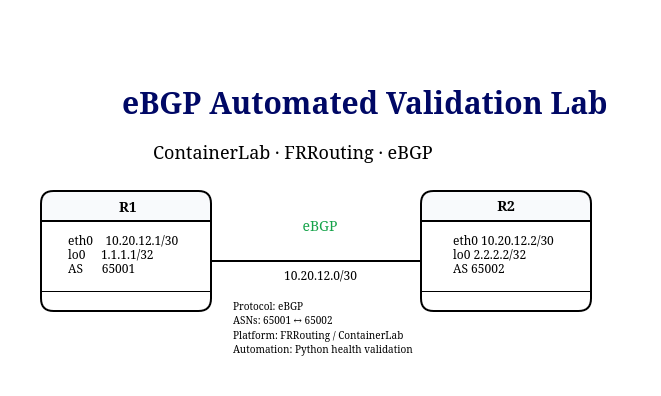

# Lab 02 v2 — eBGP Automated Validation

This lab extends the original manual eBGP topology with an automated validation workflow using Python.

The objective is to validate the complete eBGP path from session establishment to end-to-end reachability.

---

## Objective

The script automatically verifies:

- eBGP neighbor sessions
- expected remote AS numbers
- expected BGP prefixes
- best-path selection
- AS path validation
- BGP route installation in the routing table
- loopback-to-loopback reachability
- overall lab health
- persistent health reporting

---

## Topology




### Addressing

| Device | Interface | IP Address | ASN |
|---|---|---|---|
| R1 | eth1 | 10.20.12.1/30 | 65001 |
| R1 | lo | 1.1.1.1/32 | 65001 |
| R2 | eth1 | 10.20.12.2/30 | 65002 |
| R2 | lo | 2.2.2.2/32 | 65002 |

---

## Automation Workflow

```text
Python
   ↓
subprocess
   ↓
docker exec
   ↓
FRRouting / vtysh
   ↓
Collect BGP state
   ↓
Compare against expected state
   ↓
PASS / FAIL
   ↓
Generate health report
```

The script interacts with the FRRouting containers and validates the operational state of the eBGP topology.

---

# Validation Layers

## 1. BGP Session State

The script validates that both eBGP neighbors are operational.

Expected state:

```text
R1 → Neighbor 10.20.12.2 → AS65002
R2 → Neighbor 10.20.12.1 → AS65001
```

FRRouting displays a numeric value in the `State/PfxRcd` column when the BGP session is established.

Example:

```text
Neighbor        AS      State/PfxRcd
10.20.12.2      65002   1
```

If the session is down, FRR may display states such as:

```text
Idle
Active
Connect
```

---

## 2. BGP Prefix Validation

The script verifies that each router learns the remote loopback prefix.

Expected prefixes:

```text
R1 → 2.2.2.2/32
R2 → 1.1.1.1/32
```

The script also verifies that the prefix is marked as:

```text
*>
```

where:

```text
* = valid
> = best path
```

Example:

```text
*> 2.2.2.2/32  10.20.12.2  ... 65002 i
```

---

## 3. AS Path Validation

The remote prefix must also contain the expected remote ASN.

Expected AS paths:

```text
R1 → 2.2.2.2/32 → AS65002
R2 → 1.1.1.1/32 → AS65001
```

This confirms that the route is being learned from the expected BGP peer.

---

## 4. Routing Table Validation

A route may exist in the BGP table but still not be installed in the routing table.

For that reason, the script also validates:

```text
show ip route bgp
```

Expected routes:

```text
R1 → 2.2.2.2/32
R2 → 1.1.1.1/32
```

This verifies that the selected BGP route is actually installed in the RIB.

---

## 5. Data Plane Validation

The final validation checks loopback-to-loopback reachability.

```text
R1: 1.1.1.1 → 2.2.2.2
R2: 2.2.2.2 → 1.1.1.1
```

The ping uses an explicit source address.

Example:

```text
ping -I 1.1.1.1 2.2.2.2
```

This prevents false positives through the Containerlab management network.

---

# Healthy Output

Example output:

```text
=== eBGP Health Check ===
clab-frr-ebgp-r1: Neighbor 10.20.12.2 AS65002: PASS
clab-frr-ebgp-r2: Neighbor 10.20.12.1 AS65001: PASS
clab-frr-ebgp-r1: Prefix 2.2.2.2/32 via AS65002: PASS
clab-frr-ebgp-r2: Prefix 1.1.1.1/32 via AS65001: PASS
clab-frr-ebgp-r1: RIB route 2.2.2.2/32: PASS
clab-frr-ebgp-r2: RIB route 1.1.1.1/32: PASS
clab-frr-ebgp-r1: Ping 1.1.1.1 -> 2.2.2.2: PASS
clab-frr-ebgp-r2: Ping 2.2.2.2 -> 1.1.1.1: PASS

eBGP LAB STATUS: HEALTHY
```

---

# Fault Injection

To test the automated validation, the BGP configuration was intentionally broken on R2.

The correct neighbor configuration:

```text
neighbor 10.20.12.1 remote-as 65001
```

was temporarily changed to:

```text
neighbor 10.20.12.1 remote-as 65099
```

This produced a BGP AS mismatch.

---

## Failure Result

The BGP sessions transitioned to `Idle`.

Example:

```text
Neighbor        AS      State/PfxRcd
10.20.12.1      65099   Idle
```

The automated health check detected the resulting failure chain:

```text
BGP Session      FAIL
BGP Prefix       NOT FOUND
RIB Route        FAIL
Data Plane       FAIL

eBGP LAB STATUS: UNHEALTHY
```

---

# Troubleshooting Observation — BGP Policy

After restoring the correct remote AS, the BGP session recovered but routes were still not being exchanged correctly.

FRRouting displayed:

```text
State/PfxRcd   PfxSnt
(Policy)       (Policy)
```

The running configuration revealed that the inbound and outbound route-maps had been removed from the IPv4 address-family.

The missing configuration was:

```text
neighbor 10.20.12.1 route-map PERMIT-ALL in
neighbor 10.20.12.1 route-map PERMIT-ALL out
```

After restoring the BGP policy, routes were exchanged again and the health check returned to:

```text
eBGP LAB STATUS: HEALTHY
```

---

# Troubleshooting Flow

This lab demonstrates how one configuration error can propagate through several layers:

```text
Incorrect remote-as
        ↓
BGP Session Failure
        ↓
No Prefix Exchange
        ↓
No BGP Route in RIB
        ↓
No Loopback Reachability
```

The automation allows each layer to be checked independently.

---

# Health Report

Each execution generates:

```text
v2-automation/reports/bgp_health_report.txt
```

The report contains:

- BGP session status
- prefix validation
- AS path validation
- routing table validation
- loopback reachability
- final lab health status

Example:

```text
eBGP HEALTH REPORT

R1 Neighbor 10.20.12.2 AS65002: PASS
R2 Neighbor 10.20.12.1 AS65001: PASS

R1 Prefix 2.2.2.2/32 via AS65002: PASS
R2 Prefix 1.1.1.1/32 via AS65001: PASS

R1 RIB Route 2.2.2.2/32: PASS
R2 RIB Route 1.1.1.1/32: PASS

R1 Ping 1.1.1.1 -> 2.2.2.2: PASS
R2 Ping 2.2.2.2 -> 1.1.1.1: PASS

eBGP LAB STATUS: HEALTHY
```

---

# Key Lessons

This lab reinforces several important automation and BGP concepts.

### Session Up Does Not Always Mean Network Healthy

A BGP session may be established while route exchange is still blocked by policy.

```text
Session Established
        ≠
Correct Routing State
```

### Validate Multiple Layers

Reliable network validation should check:

```text
BGP Session
      ↓
BGP Table
      ↓
Best Path
      ↓
Routing Table
      ↓
Data Plane
```

### Expected State Matters

The automation does not only collect network information.

It compares:

```text
Actual State
```

against:

```text
Expected State
```

This allows the script to determine whether the network is operating according to design.

---

# Technologies Used

- Linux
- Docker
- Containerlab
- FRRouting
- eBGP
- Python
- `subprocess`
- Git
- GitHub

---

# Next Step

The next lab extends this approach to an iBGP Route Reflector topology.

Future validation will include:

- multiple BGP peers
- Route Reflector clients
- route propagation
- Originator ID
- Cluster ID
- next-hop reachability
- automated Route Reflector health validation
