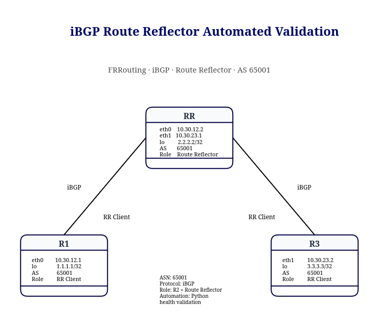

# Lab 03 v2 — iBGP Route Reflector Automated Validation

This lab extends the original iBGP Route Reflector topology with an automated validation workflow using Python.

The objective is to validate not only BGP session establishment, but also correct route reflection, next-hop handling, routing table installation, and end-to-end reachability.

---

## Objective

The script automatically verifies:

- iBGP session state
- Route Reflector operation
- reflected route presence
- best-path selection
- expected next-hop
- Originator ID
- Cluster ID
- BGP route installation in the RIB
- loopback-to-loopback reachability
- overall lab health
- persistent health reporting

---

## Topology



```text
                     AS 65001

              R2 — Route Reflector
                   2.2.2.2/32
              10.30.12.2  10.30.23.1
                  /              \
                 /                \
                /                  \
               /                    \
              R1                    R3
         RR Client              RR Client
         1.1.1.1/32             3.3.3.3/32
         10.30.12.1             10.30.23.2
```

### Addressing

| Device | Interface | IP Address | Role |
|---|---|---|---|
| R1 | eth1 | 10.30.12.1/30 | RR Client |
| R1 | lo | 1.1.1.1/32 | BGP Router ID |
| R2 | eth1 | 10.30.12.2/30 | Route Reflector |
| R2 | eth2 | 10.30.23.1/30 | Route Reflector |
| R2 | lo | 2.2.2.2/32 | BGP Router ID / Cluster ID |
| R3 | eth1 | 10.30.23.2/30 | RR Client |
| R3 | lo | 3.3.3.3/32 | BGP Router ID |

---

## Automation Workflow

```text
Python
   ↓
subprocess
   ↓
docker exec
   ↓
FRRouting / vtysh
   ↓
Collect BGP state
   ↓
Validate RR attributes
   ↓
Validate RIB
   ↓
Validate data plane
   ↓
PASS / FAIL
   ↓
Generate health report
```

---

# Validation Layers

## 1. iBGP Session State

The script verifies that both Route Reflector clients have an established iBGP session with R2.

Expected sessions:

```text
R1 → R2
R3 → R2
```

Expected ASN:

```text
AS 65001
```

A numeric value in the FRRouting `State/PfxRcd` field indicates that the BGP session is established.

---

## 2. Reflected Route Validation

The script verifies that:

```text
R1 learns 3.3.3.3/32
R3 learns 1.1.1.1/32
```

These routes must be received through the Route Reflector.

The validation checks:

- prefix presence
- valid path
- best path
- expected next-hop
- Originator ID
- Cluster ID

---

## 3. Originator ID Validation

When a Route Reflector reflects an iBGP route, the original router ID is carried in the Originator ID attribute.

Expected values:

```text
Route 3.3.3.3/32 on R1
Originator ID: 3.3.3.3

Route 1.1.1.1/32 on R3
Originator ID: 1.1.1.1
```

Example FRRouting output:

```text
Originator: 3.3.3.3
```

---

## 4. Cluster ID Validation

The Route Reflector adds its Cluster ID when reflecting a route.

In this lab, the expected Cluster ID is:

```text
2.2.2.2
```

Example:

```text
Cluster list: 2.2.2.2
```

The script validates that reflected routes contain the expected cluster information.

---

## 5. Next-Hop Validation

An important issue was discovered during the lab.

The original reflected routes appeared as:

```text
R1 → 3.3.3.3/32
Next Hop: 10.30.23.2

R3 → 1.1.1.1/32
Next Hop: 10.30.12.1
```

These next-hops were not directly reachable from the opposite client.

Initially, the configuration used:

```text
neighbor ... next-hop-self
```

However, this was not sufficient for reflected iBGP routes in this topology.

The working solution was:

```text
neighbor 10.30.12.1 next-hop-self force
neighbor 10.30.23.2 next-hop-self force
```

After this change:

```text
R1 → 3.3.3.3/32
Next Hop: 10.30.12.2

R3 → 1.1.1.1/32
Next Hop: 10.30.23.1
```

The Route Reflector becomes a reachable next-hop for both clients.

---

## 6. Routing Table Validation

The script checks that the reflected routes are installed in the routing table.

Expected RIB entries:

```text
R1 → 3.3.3.3/32
R3 → 1.1.1.1/32
```

This verifies that the BGP route is not only present in the BGP table but is also usable by the forwarding plane.

---

## 7. Data Plane Validation

Loopback-to-loopback reachability is validated using explicit source addresses.

Expected tests:

```text
R1: 1.1.1.1 → 3.3.3.3
R3: 3.3.3.3 → 1.1.1.1
```

This confirms that the reflected routes are operational end-to-end.

---

# Healthy Output

Example:

```text
=== iBGP Route Reflector Health Check ===
clab-frr-ibgp-rr-r1: BGP neighbor 10.30.12.2: PASS
clab-frr-ibgp-rr-r3: BGP neighbor 10.30.23.1: PASS
clab-frr-ibgp-rr-r1: Reflected route 3.3.3.3/32: PASS
clab-frr-ibgp-rr-r3: Reflected route 1.1.1.1/32: PASS
clab-frr-ibgp-rr-r1: RIB route 3.3.3.3/32: PASS
clab-frr-ibgp-rr-r3: RIB route 1.1.1.1/32: PASS
clab-frr-ibgp-rr-r1: Ping 1.1.1.1 -> 3.3.3.3: PASS
clab-frr-ibgp-rr-r3: Ping 3.3.3.3 -> 1.1.1.1: PASS

iBGP RR LAB STATUS: HEALTHY
```

---

# Fault Injection

The Route Reflector configuration was intentionally modified to test automated failure detection.

The `route-reflector-client` configuration was removed.

Example:

```text
no neighbor 10.30.12.1 route-reflector-client
no neighbor 10.30.23.2 route-reflector-client
```

---

## Client / Non-Client Behavior

An important observation was made during troubleshooting.

Removing `route-reflector-client` from only one peer did not completely break route propagation.

This is because a Route Reflector can still reflect routes between clients and non-clients according to iBGP Route Reflector rules.

When both peers were changed to non-clients, route reflection between R1 and R3 stopped.

---

## Failure Result

The BGP sessions remained established:

```text
BGP Sessions: PASS
```

However:

```text
Reflected Routes: FAIL
RIB Routes: FAIL
Loopback Reachability: FAIL
```

Example:

```text
=== iBGP Route Reflector Health Check ===
clab-frr-ibgp-rr-r1: BGP neighbor 10.30.12.2: PASS
clab-frr-ibgp-rr-r3: BGP neighbor 10.30.23.1: PASS
clab-frr-ibgp-rr-r1: Reflected route 3.3.3.3/32: FAIL
clab-frr-ibgp-rr-r3: Reflected route 1.1.1.1/32: FAIL
clab-frr-ibgp-rr-r1: RIB route 3.3.3.3/32: FAIL
clab-frr-ibgp-rr-r3: RIB route 1.1.1.1/32: FAIL
clab-frr-ibgp-rr-r1: Ping 1.1.1.1 -> 3.3.3.3: FAIL
clab-frr-ibgp-rr-r3: Ping 3.3.3.3 -> 1.1.1.1: FAIL

iBGP RR LAB STATUS: UNHEALTHY
```

---

# Recovery

The Route Reflector client configuration was restored:

```text
neighbor 10.30.12.1 route-reflector-client
neighbor 10.30.23.2 route-reflector-client
```

And the working next-hop configuration was retained:

```text
neighbor 10.30.12.1 next-hop-self force
neighbor 10.30.23.2 next-hop-self force
```

After recovery, the automated validation returned to:

```text
iBGP RR LAB STATUS: HEALTHY
```

---

# Troubleshooting Flow

This lab demonstrates two important failure scenarios.

### Scenario 1 — Unreachable Reflected Next-Hop

```text
BGP Sessions UP
        ↓
Reflected Route Received
        ↓
Original Next-Hop Preserved
        ↓
Next-Hop Unreachable
        ↓
Route Not Selected
        ↓
No End-to-End Reachability
```

Solution:

```text
next-hop-self force
```

### Scenario 2 — Route Reflector Client Configuration Missing

```text
BGP Sessions UP
        ↓
No RR Client Relationship
        ↓
iBGP Split-Horizon Applies
        ↓
Routes Not Reflected
        ↓
RIB Missing
        ↓
Data Plane Failure
```

---

# Health Report

Each execution generates:

```text
v2-automation/reports/rr_health_report.txt
```

The report contains:

- iBGP session state
- reflected route validation
- RIB validation
- loopback reachability
- overall lab status

Example:

```text
iBGP ROUTE REFLECTOR HEALTH REPORT

R1 -> RR Session: PASS
R3 -> RR Session: PASS

R1 Reflected Route 3.3.3.3/32: PASS
R3 Reflected Route 1.1.1.1/32: PASS

R1 RIB Route 3.3.3.3/32: PASS
R3 RIB Route 1.1.1.1/32: PASS

R1 Ping 1.1.1.1 -> 3.3.3.3: PASS
R3 Ping 3.3.3.3 -> 1.1.1.1: PASS

iBGP RR LAB STATUS: HEALTHY
```

---

# Key Lessons

This lab reinforces several important BGP and automation concepts.

### BGP Established Is Not Enough

A BGP session can be fully established while route reflection is broken.

```text
BGP Session UP
      ≠
Route Reflection Working
```

### Validate Route Attributes

A reflected route should be validated beyond simple prefix presence.

Important attributes include:

```text
Best Path
Next-Hop
Originator ID
Cluster ID
```

### Route Reflector Client Relationships Matter

Route propagation depends on whether peers are configured as:

```text
RR Client
```

or:

```text
Non-Client
```

### Next-Hop Reachability Is Critical

Receiving a route does not guarantee that the route is usable.

The next-hop must also be reachable.

### Automation Should Validate Multiple Layers

```text
BGP Session
      ↓
Route Reflection
      ↓
BGP Attributes
      ↓
RIB
      ↓
Data Plane
```

---

# Technologies Used

- Linux
- Docker
- Containerlab
- FRRouting
- iBGP
- Route Reflector
- Python
- `subprocess`
- Git
- GitHub

---

# Next Step

The next lab extends the automation workflow to BGP policy validation.

Future checks will include:

- Local Preference
- route-maps
- prefix filtering
- best-path manipulation
- policy verification
- automated detection of incorrect path selection
