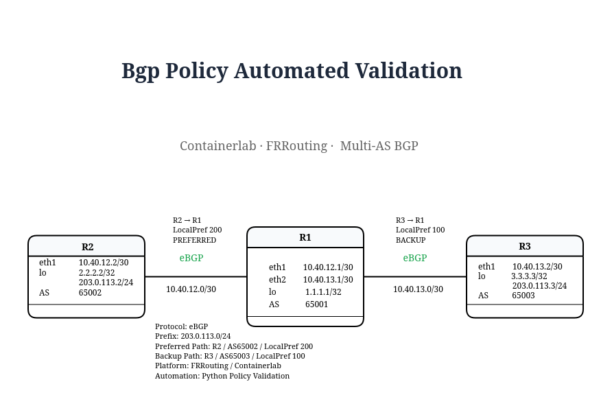

# Lab 04 v2 — BGP Policy Automated Validation

This lab extends the original multi-AS BGP topology with an automated validation workflow focused on routing policy and expected-path verification.

The objective is not only to confirm that BGP sessions are established, but also to verify that the network is selecting the path defined by the intended routing policy.

---

## Objective

The automation validates:

- eBGP session state
- expected remote AS numbers
- presence of multiple paths for the same prefix
- Local Preference values
- expected best-path selection
- backup-path presence
- BGP route installation in the RIB
- expected next-hop in the routing table
- overall policy health
- persistent health reporting

---

## Topology




### Addressing and Roles

| Device | Interface | IP Address | ASN | Role |
|---|---|---|---:|---|
| R1 | eth1 | 10.40.12.1/30 | 65001 | Policy decision point |
| R1 | eth2 | 10.40.13.1/30 | 65001 | Policy decision point |
| R1 | lo | 1.1.1.1/32 | 65001 | Router ID |
| R2 | eth1 | 10.40.12.2/30 | 65002 | Preferred upstream |
| R2 | lo | 2.2.2.2/32 | 65002 | Router ID |
| R2 | lo | 203.0.113.2/24 | 65002 | Originates 203.0.113.0/24 |
| R3 | eth1 | 10.40.13.2/30 | 65003 | Backup upstream |
| R3 | lo | 3.3.3.3/32 | 65003 | Router ID |
| R3 | lo | 203.0.113.3/24 | 65003 | Originates 203.0.113.0/24 |

---

## Routing Intent

Both R2 and R3 advertise the same prefix:

```text
203.0.113.0/24
```

R1 must prefer the path through R2.

Expected policy:

```text
R2 / AS65002
Local Preference: 200
Role: PREFERRED

R3 / AS65003
Local Preference: 100
Role: BACKUP
```

The expected RIB next-hop on R1 is:

```text
10.40.12.2
```

---

## Automation Workflow

```text
Python
   ↓
subprocess
   ↓
docker exec
   ↓
FRRouting / vtysh
   ↓
Collect BGP state
   ↓
Parse individual BGP paths
   ↓
Compare with routing intent
   ↓
Validate RIB next-hop
   ↓
PASS / FAIL
   ↓
Generate health report
```

---

# Validation Layers

## 1. eBGP Session Validation

The script checks both eBGP sessions from R1.

Expected neighbors:

```text
R1 → 10.40.12.2 / AS65002
R1 → 10.40.13.2 / AS65003
```

Healthy sessions return a numeric value in FRRouting's `State/PfxRcd` field.

---

## 2. Multiple-Path Validation

R1 should receive two valid paths for:

```text
203.0.113.0/24
```

Expected paths:

```text
via 10.40.12.2 / AS65002
via 10.40.13.2 / AS65003
```

This confirms that both upstream paths are available before policy is evaluated.

---

## 3. Local Preference Validation

The preferred path must have:

```text
Next-hop: 10.40.12.2
AS: 65002
LocalPref: 200
```

The backup path uses the default Local Preference:

```text
Next-hop: 10.40.13.2
AS: 65003
LocalPref: 100
```

The automation parses the attributes belonging to each BGP path instead of searching for unrelated strings across the entire command output.

---

## 4. Best-Path Validation

The preferred R2 path must be selected as best.

Healthy FRRouting output includes:

```text
localpref 200, valid, external, best (Local Pref)
```

The script verifies that the `best` attribute belongs specifically to the R2 path.

This prevents false positives where the correct Local Preference exists but another path is actually selected.

---

## 5. Backup-Path Validation

The R3 path must remain present but must not be selected as best.

Expected condition:

```text
R3 path present: YES
R3 best path: NO
```

This confirms that redundancy exists while routing intent remains correct.

---

## 6. RIB Validation

The BGP control plane is not enough by itself.

The script also validates the installed route using:

```text
show ip route bgp
```

Expected state:

```text
B>* 203.0.113.0/24 via 10.40.12.2
```

This confirms that the forwarding decision matches the intended BGP policy.

---

# Healthy Output

```text
=== BGP Policy Health Check ===
clab-frr-bgp-policy-r1: Neighbor 10.40.12.2 AS65002: PASS
clab-frr-bgp-policy-r1: Neighbor 10.40.13.2 AS65003: PASS
clab-frr-bgp-policy-r1: BGP policy for 203.0.113.0/24: PASS
clab-frr-bgp-policy-r1: RIB 203.0.113.0/24 via 10.40.12.2: PASS

BGP POLICY LAB STATUS: HEALTHY
```

---

# Fault Injection

To validate policy-drift detection, the backup path through R3 was intentionally assigned a higher Local Preference.

Temporary policy:

```text
route-map SET-LOCALPREF-R3 permit 10
 set local-preference 250
```

Applied inbound from R3:

```text
neighbor 10.40.13.2 route-map SET-LOCALPREF-R3 in
```

This changed the effective routing decision to:

```text
R3 / AS65003
LocalPref 250
BEST

R2 / AS65002
LocalPref 200
BACKUP
```

The network remained operational, but the routing decision no longer matched the intended design.

---

## Failure Detection

The initial validation logic produced a false positive because it searched for `localpref 200` and `best (Local Pref)` independently across the entire BGP output.

The parser was improved to correlate attributes with the specific BGP path.

The corrected health check reported:

```text
=== BGP Policy Health Check ===
clab-frr-bgp-policy-r1: Neighbor 10.40.12.2 AS65002: PASS
clab-frr-bgp-policy-r1: Neighbor 10.40.13.2 AS65003: PASS
clab-frr-bgp-policy-r1: BGP policy for 203.0.113.0/24: FAIL
  Expected best via 10.40.12.2 LP 200 | Actual LP 200 Best=False
  Backup via 10.40.13.2 Best=True
clab-frr-bgp-policy-r1: RIB 203.0.113.0/24 via 10.40.12.2: FAIL

BGP POLICY LAB STATUS: UNHEALTHY
```

This demonstrates the difference between:

```text
Network Reachable
```

and:

```text
Network Operating According to Intent
```

---

# Recovery

The temporary Local Preference policy on R3 was removed and the original policy restored.

Expected state after recovery:

```text
R2 → LocalPref 200 → BEST
R3 → LocalPref 100 → BACKUP
```

The automated health check returned to:

```text
BGP POLICY LAB STATUS: HEALTHY
```

---

# Troubleshooting Flow

```text
BGP Sessions UP
        ↓
Both Paths Present
        ↓
Policy Attributes Evaluated
        ↓
Unexpected Higher LocalPref
        ↓
Wrong Best Path
        ↓
Wrong RIB Next-Hop
        ↓
Routing Intent Violation
```

This is an important distinction because the network may remain fully reachable while operating with an incorrect policy.

---

# Health Report

Each execution generates:

```text
v2-automation/reports/policy_health_report.txt
```

The report includes:

- R1 → R2 session status
- R1 → R3 session status
- policy validation
- expected RIB next-hop
- final lab health status

Example:

```text
BGP POLICY HEALTH REPORT

R1 -> R2 Session: PASS
R1 -> R3 Session: PASS

Policy 203.0.113.0/24 via R2 LocalPref 200: PASS
RIB 203.0.113.0/24 via 10.40.12.2: PASS

BGP POLICY LAB STATUS: HEALTHY
```

---

# Key Lessons

## BGP Established Is Not Enough

Both BGP sessions can remain fully established while the wrong path is selected.

```text
BGP Sessions UP
      ≠
Routing Intent Correct
```

## Reachability Is Not the Same as Correctness

The network may remain reachable while traffic exits through an unintended upstream path.

For that reason, validation must include:

```text
Session State
     ↓
Available Paths
     ↓
Path Attributes
     ↓
Best Path
     ↓
RIB
```

## Correlate Attributes With the Correct Path

A major automation lesson from this lab was the danger of searching for independent strings across unstructured CLI output.

The parser was improved to associate:

```text
Next-Hop
AS Path
Local Preference
Best-Path State
```

with the same BGP path.

## Validate Intent, Not Only State

The goal of the lab is not simply to ask:

```text
Is BGP working?
```

but instead:

```text
Is BGP making the routing decision that the design expects?
```

This is a core concept in modern network automation and assurance.

---

# Technologies Used

- Linux
- Docker
- Containerlab
- FRRouting
- eBGP
- BGP Local Preference
- BGP Best-Path Selection
- Route Maps
- Python
- `subprocess`
- Git
- GitHub

---

# Next Step

The next stage moves from protocol and policy validation toward larger-scale network automation.

Planned topics include:

- automated Spine-Leaf validation
- multi-device inventory
- reusable expected-state models
- VXLAN automation
- BGP EVPN automation
- fabric-wide health checks
- automated fault detection and troubleshooting
